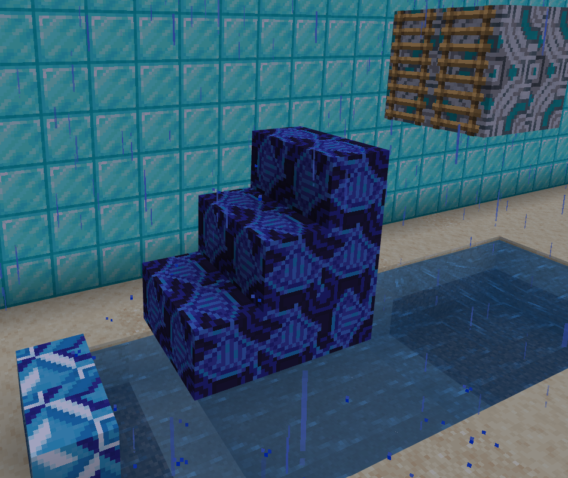
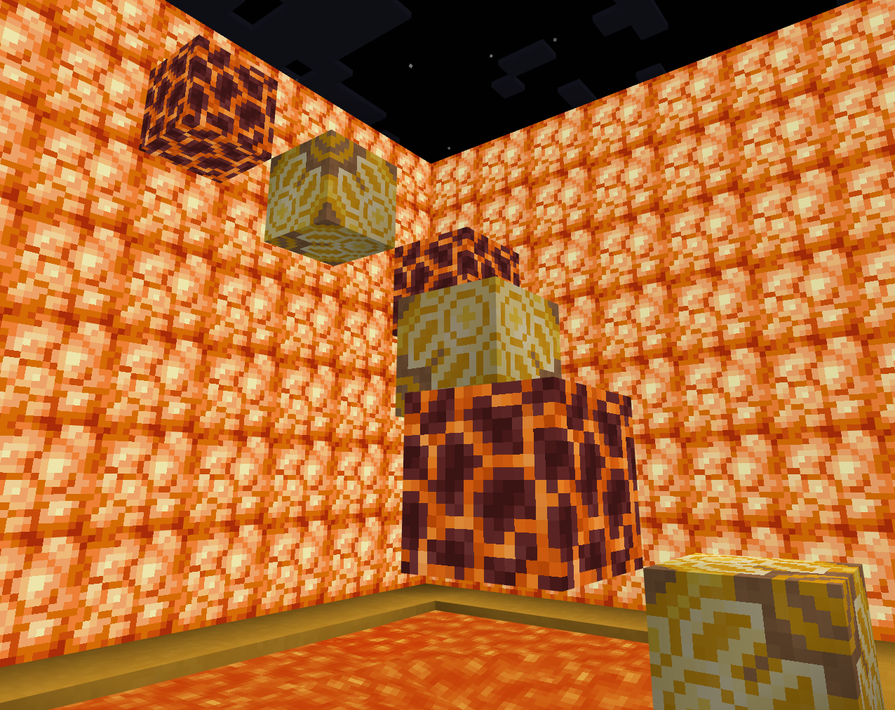
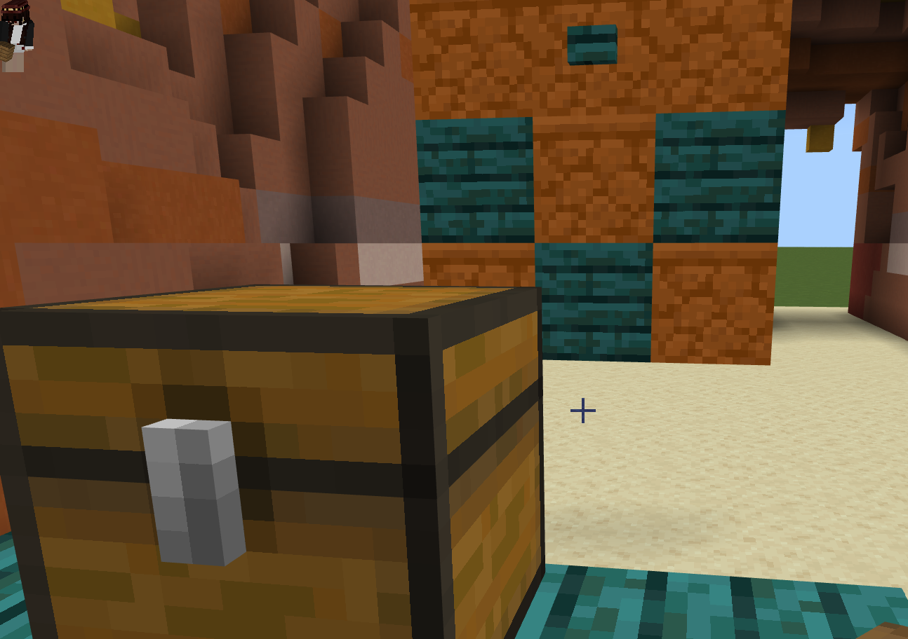
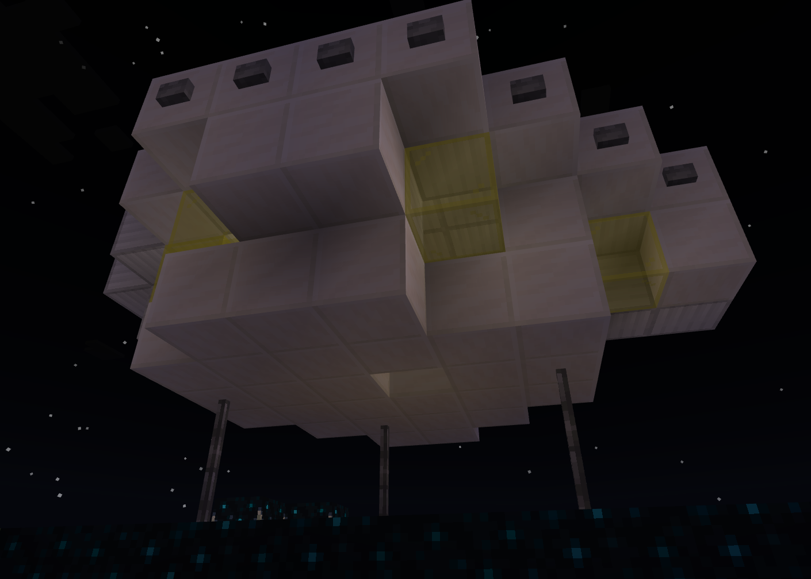

# Parkour World Creation Guide

Whew! That was a lot of information. So far, we've covered gameplay creation and how to use parkour mechanics to make a fun gameplay loop.

In this tutorial, you will learn the following:

> [!div class="checklist"]
>
> - What to keep in mind while developing your own parkour map.
> - How gameplay development uses planning, development, testing and release process to release games.

## Design the Map

First things first: think about a theme you'd like to create for your map. Themes could be anything, from existing biomes to water worlds to a volcanic map.

Having a sense of decorations or design in mind before getting started can help you create a unique gameplay experience.

## Plan Challenges

We'll plan parkour content that gets players excited. We'll start off with themes and concepts as well as think about what our gameplay should be like.  Planning includes lots of information, like deciding on a theme and which types of challenges we want players to experience.

### Player Mechanics

Decide which player mechanics you want players to face. Are you creating a difficult map? Maybe lean towards the more advanced jumps we showed you, or even find others that can be even more fun.

A simple water themed world might start off slow with some basic jumps.

### Block Mechanics

Block mechanics are another great way to add variation. Unlike our tutorial map, you can mix those as well.

A volcanic themed world might call for a lot of magma blocks.

### Redstone Puzzles

Finally, what Redstone puzzles will you create? Lean on your theme for this.

If you were doing an archaeology adventure theme, players could hit a button with an arrow to reveal a new path.

### Ending

Finally, what would be a fun place to end your map with your theme in mind? A space themed map could end with players discovering a UFO to explore.

Think about how you can make the end of the map fun too. Fireworks, signs, or anything else you can think of that would be fun for players.

## Build Your World

Time to start building!

### Create the Flat World

While command blocks can be used in any Minecraft world, we will be
using a flat world for a simple and clean environment.

1. Launch Minecraft: Bedrock Edition.
1. Select **Play**, select **Create New**, then select **Create New
    World**.
1. In the world settings, set the world type to **Flat**.
1. In the world settings, enable **Show Coordinates**.
1. In the world settings, enable **Activate Cheats**.
1. Select **Create**.

Alright! Now you have a clear, flat plane to start developing on. Time to build and iterate on your map.

## Test

I test early and often. Pretty much every jump or location you put down in your level is worth testing.

Here are some things to test in a parkour map

- Is your path clearly laid out?
- Can the jumps be completed?
- Is the happy path fun to run? Do the jumps feel fun together?
- Do players have enough food to survive treacherous challenges in their way?
- Are there checkpoints so that players can save progress if you want them to?
- If a player falls off the map you laid out, will they die?
- Do all your jumps work as anticipated? Now is the time to ensure the parkour path works as expected, before decorating or completing the ending of the map.

## Decorate Based On Theme

It's super important to test all your jumps before beginning to add decorations. You'll more than double your work if you're moving a bunch of awesome decorations on top of tweaking your jumps.

## Release

### Prepare World for Release

- Turn on `Keep Inventory` in Settings so that players will not lose items you expect them to have in the map.
- Make sure the player begins at the right place on your map by using `/setworldspawn` in the right location and facing the right direction.
- Players will receive anything you have in your inventory.
- Change the gameplay mode to Adventure so players can't punch through your walls.
- Export the world to ensure you can share a copy with people and so that you have a clean copy of the world that doesn't have any items removed or puzzles triggered.

### Release Methods

We'll talk about sharing a world with others. There are several approaches possible:

- Create a realm to invite other players to
- Host a game with your friends in your world
- [Create a World Template](CreateAWorldTemplate.md) with our handy guide

## What's Next?

You've created an awesome parkour map you can share with friends and other players. You've learned gameplay mechanics and have a grasp of how game development works. Now you can make your map even more fun by creating themed block designs with a custom resource pack.

> [!div class="nextstepaction"]
> [Resource Pack](ResourcePack.md)
